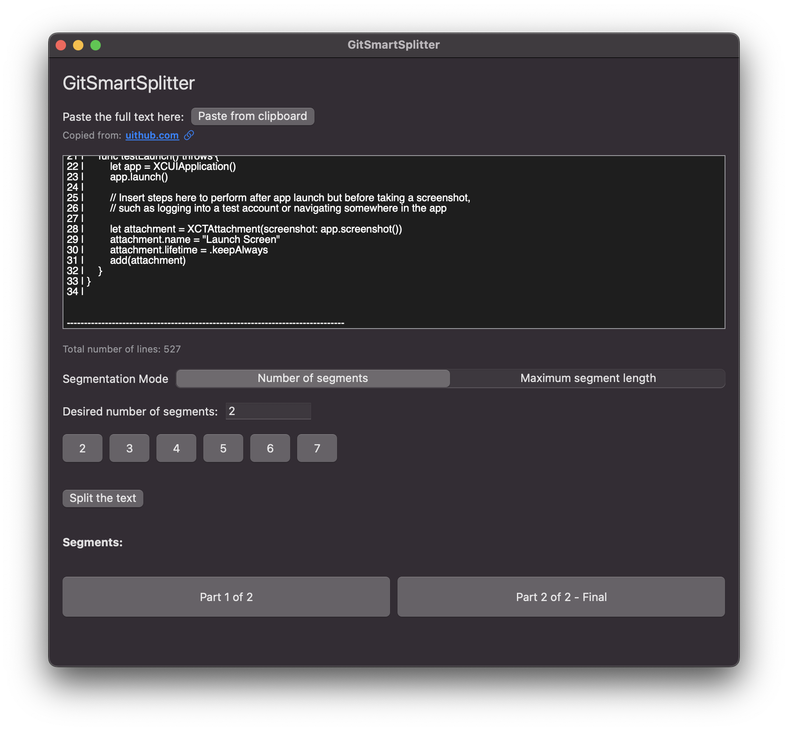

# GitSmartSplitter

> ✂️ A clean and efficient macOS SwiftUI app to split large text blocks into manageable segments — perfect for GitHub, documentation, or messaging platforms.

---

## 📚 Table of Contents

- [Overview](#overview)
- [Features](#features)
- [Screenshots](#screenshots)
- [Installation](#installation)
- [Build & Run (Xcode)](#build--run-xcode)
- [File Structure](#file-structure)
- [Localization](#localization)
- [Planned Features](#planned-features)
- [License](#license)

---

## 🧠 Overview

GitSmartSplitter allows you to paste large chunks of text (e.g. copied from GitHub or other tools) and split them either:

- by maximum character length  
- or by desired number of segments.

It adds contextual headers to each segment and enables one-click copying for easy use in chats, documentation, etc.

---

## ✨ Features

- 📋 Paste directly from clipboard
- 🔢 Choose between number of segments or character limit
- 🧠 Smart splitting: prefers clean breaks on separator lines
- 🔗 Clickable reference link (`uithub.com`)
- 🖱️ One-click copy for each segment with animated feedback
- 🌍 Multilingual support: English (default), French, and German
- 📐 Resizable, native SwiftUI interface
- 🧪 Includes unit and UI tests

---

## 📸 Screenshots

### 🖼️ Main Interface



This screenshot shows the main interface of GitSmartSplitter:
- A clean, native SwiftUI layout
- Text input with clipboard support
- Toggle between segmentation modes
- Smart preview of segments with copy buttons

---

## 🛠 Installation

You can either:

- Download the `.app` from the [Releases](https://github.com/your-username/GitSmartSplitter/releases)
- Or clone and build manually (see below)

---

## 💻 Build & Run (Xcode)

1. Clone the repository:

   ```bash
   git clone https://github.com/your-username/GitSmartSplitter.git
   cd GitSmartSplitter
   ```

2. Open the project in Xcode:

   ```bash
   open GitSmartSplitter.xcodeproj
   ```

3. Select your target (Mac).
4. Build & run using the ▶️ button or `Cmd + R`.

> 📌 *Tested on macOS Sequoia + Xcode 16.0*

---

## 🗂 File Structure

```
GitSmartSplitter/
├── GitSmartSplitter/
│   ├── GitSmartSplitterApp.swift          # App entry point
│   ├── ContentView.swift                  # Main UI
│   ├── SegmentButtonView.swift            # Segment copy buttons
│   ├── SegmentationFunctions.swift        # Logic for smart splitting
│   └── SplitMode.swift                    # Enum for split modes
├── GitSmartSplitterTests/
│   └── GitSmartSplitterTests.swift        # Unit tests
└── GitSmartSplitterUITests/
    ├── GitSmartSplitterUITests.swift
    └── GitSmartSplitterUITestsLaunchTests.swift
```

---

## 🌐 Localization

GitSmartSplitter currently supports:

- 🇬🇧 English (default)
- 🇫🇷 French
- 🇩🇪 German

Translations use `NSLocalizedString` and `LocalizedStringKey` for seamless SwiftUI integration. New language support can be added via `.strings` files in Xcode.

---

## 🧭 Planned Features

- 🌎 Additional languages (Spanish, Italian…)
- 💾 Export segments as `.txt` files
- ☁️ iCloud clipboard sync
- 🧪 Advanced testing suite
- ⚙️ Custom delimiter recognition (e.g. `===`, `##`, etc.)

---

## 📄 License

This project is licensed under the MIT License. See [LICENSE](./LICENSE) for details.

---

Made with ❤️ by [Lukas Mauffré](https://github.com/LukasMFR)
